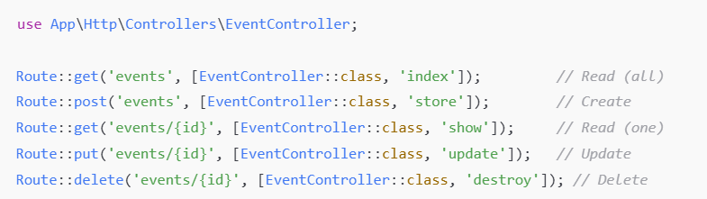
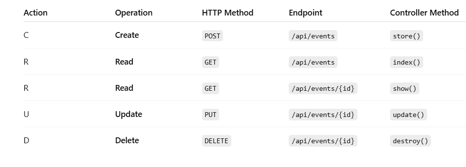

    # Project Removal 

### Framework: Laravel (v8 or above)
Authentication: Must include user login, registration, and logout using Laravel Sanctum or Passport.
CRUD Functionality: Implement at least one model (e.g., Product, Event, Student, Task, etc.) with full CRUD (Create, Read, Update, Delete) functionality.
API Count:
Minimum of 5 APIs excluding authentication routes.
Example: /api/events, /api/events/{id}, /api/tasks, /api/categories, etc.
Postman Collection:
Export and include a fully working Postman collection with all API routes, including sample requests and token-based authorization headers (if applicable).

## PHP Repo [Link:](https://github.com/Cbelandres/ELPHP_BELANDRES_Cr_removal.git)
* [https://github.com/Cbelandres/ELPHP_BELANDRES_Cr_removal.git](https://github.com/Cbelandres/ELPHP_BELANDRES_Cr_removal.git)

Spesific api's excluding authentication and the CRUD function being used
[
]

